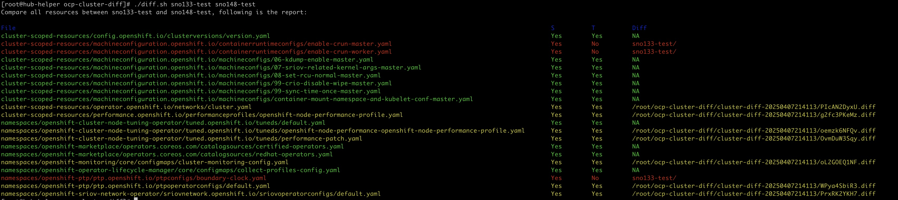

## Usage

### Generate must-gather

Note that the default must-gather image may not collect all the resources required for the comparison, so a custom 
image can/shall be used in this repo. 

Update the [resources.cfg](collection-scripts/resources.cfg) based on your needs to if you need to compare additional resources. Build the 
image and publish it to your registry so that you can fetch the cluster data accordingly. 

In this repo, we built and published the image to quay.io/bzhai/caas-vdu-must-gather:4.16

To generate a custom must-gather, run command below towards the clusters you want to compare:

```shell
# cluster 1
oc adm must-gather --image=quay.io/bzhai/vdu-caas-must-gather:4.16 --dest-dir cluster1-must-gather
# cluster 2
oc adm must-gather --image=quay.io/bzhai/vdu-caas-must-gather:4.16 --dest-dir cluster2-must-gather
```

### Compare

Then compare the collected resources:

```shell
diff.sh cluster1-must-gather cluster2-must-gather
```

### Demo




### Extend

You can update the file [resources.cfg](collection-scripts/resources.cfg) to add/remove resoures:
```shell

cluster_scoped_resources=(
  "clusterversion/version"
  "containerruntimeconfigs"
  "performanceprofiles"
  "networks.operator.openshift.io/cluster"
  "mc/container-mount-namespace-and-kubelet-conf-master"
  "mc/06-kdump-enable-master"
  "mc/07-sriov-related-kernel-args-master"
  "mc/08-set-rcu-normal-master"
  "mc/99-crio-disable-wipe-master"
  "mc/99-sync-time-once-master"
)

namespaced_resources=(
  "openshift-cluster-node-tuning-operator tuned"
  "openshift-monitoring cm/cluster-monitoring-config"
  "openshift-operator-lifecycle-manager cm/collect-profiles-config"
  "openshift-marketplace catalogsource/redhat-operators"
  "openshift-marketplace catalogsource/certified-operators"
  "openshift-ptp ptpconfig"
  "openshift-ptp ptpoperatorconfig"
  "openshift-sriov-network-operator SriovOperatorConfig"
)

```

then modify .env so that you can build and publish the image to your own registry:

```
DOCKER_IMAGE=<your_registry>/vdu-caas-must-gather
DOCKER_TAG=4.16
```

```shell
make podman_build podman_publish
```
